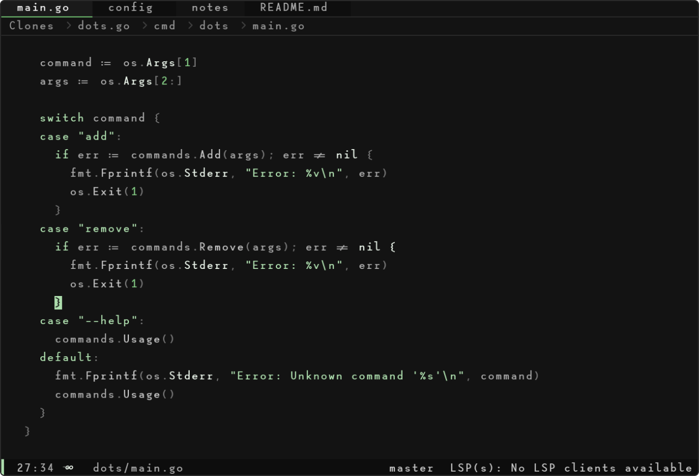
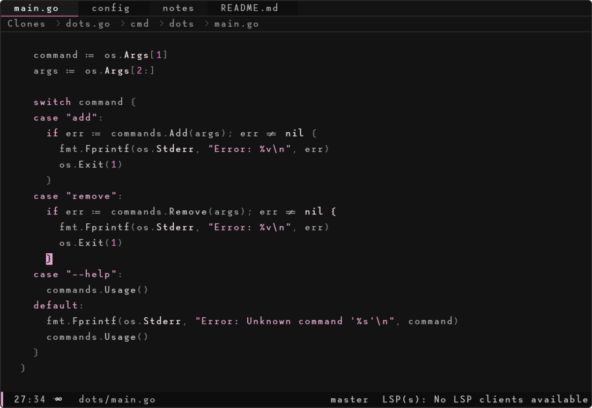
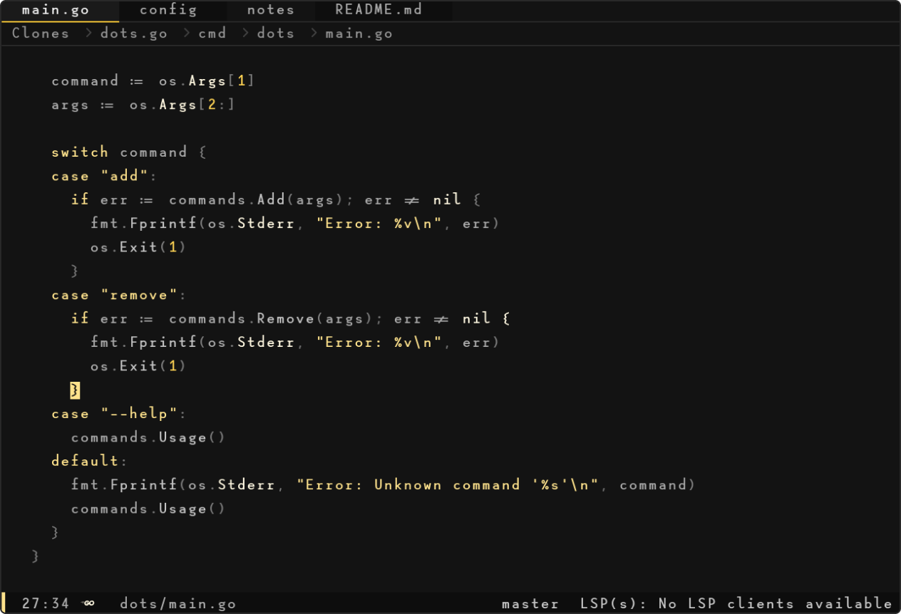

A minimalist Neovim colorscheme generator that creates monochrome themes with accent highlights from background, foreground, and accent colors.

## Previews



```lua
xeno.new_theme('xeno-lilypad', {
  base = '#1E1E1E',
  accent = '#8CBE8C',
})
```



```lua
xeno.new_theme('xeno-pink-haze', {
  base = '#1E1E1E',
  accent = '#8CBE8C',
})

```


```lua
xeno.new_theme('xeno-golden-hour', {
  base = '#1E1E1E',
  accent = '#8CBE8C',
})
```

## Installation

Using [lazy.nvim](https://github.com/folke/lazy.nvim):

```lua
{
  'kyza0d/xeno.nvim',
  lazy = false,
  priority = 1000, -- Load colorscheme early
  config = function()
    require('xeno').setup()
  end,
}
```

Using [packer.nvim](https://github.com/wbthomason/packer.nvim):

```lua
use {
  'kyza0d/xeno.nvim',
  config = function()
    require('xeno').setup() -- Use default colors
  end
}
```

## Usage

### Basic Configuration

```lua
-- Create a new theme
require('xeno').new_theme('my-new-theme', {
  background = '#1a1a1a',
  foreground = '#e0e0e0', 
  accent = '#7aa2f7',
})

vim.cmd('colorscheme my-new-theme')
```

### Global Configuration Options

Global configuration options affect all themes and are set using `xeno.config()`:

```lua
-- Set global configuration options
require('xeno').config({
  -- Appearance adjustments
  contrast = 0,            -- Adjust contrast (-1 to 1, 0 is default)
  variation = 0,           -- Adjust color variation strength (-1 to 1, 0 is default)
  transparent = false,     -- Enable transparent background
})
```

### Plugin Manager Configuration

Using [lazy.nvim](https://github.com/folke/lazy.nvim) with global options:

```lua
{
  'kyza0d/xeno.nvim',
  lazy = false,
  priority = 1000,
  opts = {
    transparent = true,
    contrast = 0.1,
  },
  config = function(_, opts)
    local xeno = require('xeno')
    
    xeno.config(opts)
    xeno.setup()
  end,
}
```

## Customization

MIT
