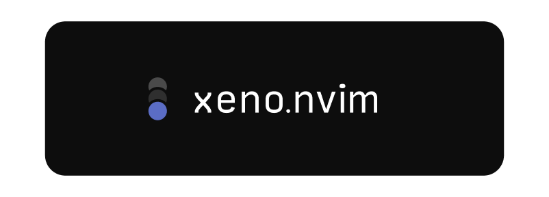

<p align='center'>
  Colorscheme generator that creates minimalist themes using two colors.
</p>

<br/>

## Previews


```lua
xeno.new_theme('xeno-lilypad', {
  base = '#1E1E1E',
  accent = '#8CBE8C',
  contrast = 0.1,
})
```


```lua
xeno.new_theme('xeno-pink-haze', {
  base = '#0f0c0e',
  accent = '#D19EBC',
  contrast = 0.1,
})

```


```lua
xeno.new_theme('xeno-golden-hour', {
  base = '#11100f',
  accent = '#FFCC33',
  contrast = 0.1,
})
```

## Installation

<details>
<summary><strong>lazy.nvim</strong> (recommended)</summary>

```lua
{
  'kyza0d/xeno.nvim',
  lazy = false,
  priority = 1000, -- Load colorscheme early
  config = function()
    -- Create your custom theme here
    require('xeno').new_theme('my-theme', {
      base = '#1E1E1E',
      accent = '#8CBE8C',
    })
    vim.cmd('colorscheme my-theme')
  end,
}
```

</details>

<details>
<summary><strong>packer.nvim</strong></summary>

```lua
use {
  'kyza0d/xeno.nvim',
  config = function()
    -- Create your custom theme
    require('xeno').new_theme('my-theme', {
      base = '#1E1E1E',
      accent = '#8CBE8C',
    })
    vim.cmd('colorscheme my-theme')
  end
}
```

</details>

<details>
<summary><strong>vim-plug</strong></summary>

```vim
Plug 'kyza0d/xeno.nvim'
```

Then add to your `init.vim` or `init.lua`:
```lua
-- Create your custom theme
require('xeno').new_theme('my-theme', {
  base = '#1E1E1E',
  accent = '#8CBE8C',
})
vim.cmd('colorscheme my-theme')
```

</details>

<details>
<summary><strong>paq-nvim</strong></summary>

```lua
require "paq" {
  'kyza0d/xeno.nvim';
}
```

Then add to your config:
```lua
-- Create your custom theme
require('xeno').new_theme('my-theme', {
  base = '#1E1E1E',
  accent = '#8CBE8C',
})
vim.cmd('colorscheme my-theme')
```

</details>

## Usage

**Note:** Xeno.nvim does not provide any default colorschemes. You must create your own themes using the configuration options below.

### Basic Configuration

```lua
-- Create a new theme
require('xeno').new_theme('my-new-theme', {
  base = '#1a1a1a',
  accent = '#7aa2f7',
})

vim.cmd('colorscheme my-new-theme')
```

### Global Configuration Options

Global configuration options affect all themes and are set using `xeno.config()`:

```lua
-- Set global configuration options
require('xeno').config({
  -- Appearance adjustments
  contrast = 0,            -- Adjust contrast (-1 to 1, 0 is default)
  variation = 0,           -- Adjust color variation strength (-1 to 1, 0 is default)
  transparent = false,     -- Enable transparent background
})
```

### Plugin Manager Configuration

Using [lazy.nvim](https://github.com/folke/lazy.nvim) with global options:

```lua
{
  'kyza0d/xeno.nvim',
  lazy = false,
  priority = 1000,
  opts = {
    transparent = true,
    contrast = 0.1,
  },
  config = function(_, opts)
    local xeno = require('xeno')
    
    xeno.config(opts)
    
    -- Create your custom theme
    xeno.new_theme('my-theme', {
      base = '#1E1E1E',
      accent = '#8CBE8C',
    })
    vim.cmd('colorscheme my-theme')
  end,
}
```

## Customization

MIT
